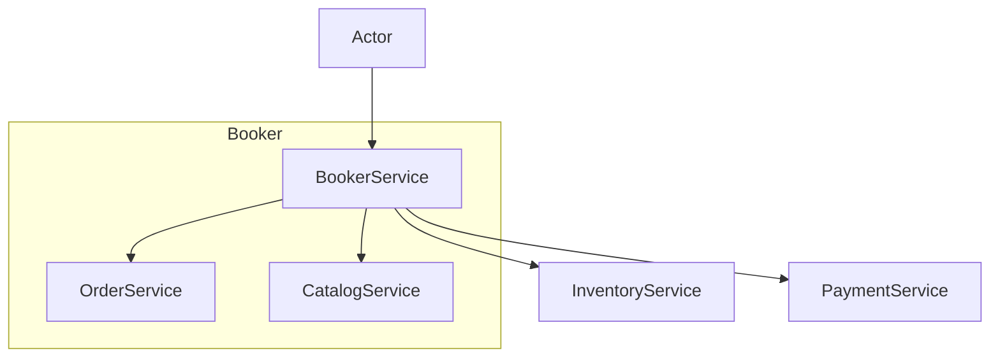

# playground dummy

trying to learn things about observability, more likely in a distributed manner

## 

```mermaid
graph TD;
    Actor --> BookerService;
    BookerService --> InventoryService;
    BookerService --> PaymentService;
    subgraph Booker
        BookerService --> OrderService;
        BookerService --> CatalogService;
    end

```

## todos
* create dummy services and collectable data
* export, analyze, visualize